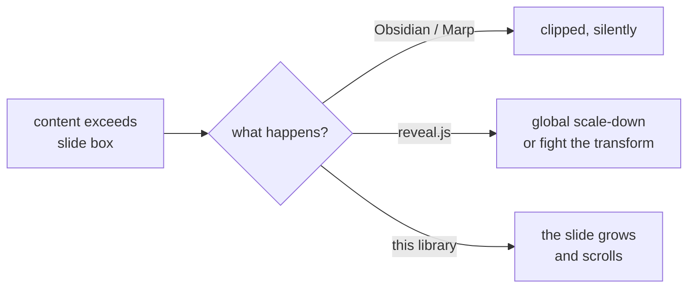

# Design: `@logosdx/slides` — HTML-native presentation primitives


## Problem


Presentation tools force authors to choose between *expressive* and *navigable*, and never give both.

- **Slide tools** (PowerPoint, Google Slides, Keynote) are navigable but expressively dead: a slide is a fixed canvas, not a document.
- **Markdown slide tools** (Obsidian Slides, Marp, Slidev) are authorable but clip. When content exceeds the slide box it is **silently cut off** — there is no scroll, no overflow affordance, nothing. The author's only recourse is to shrink the font or split the slide.
- **reveal.js** solves navigation properly but owns positioning via CSS transforms, so scrolling inside a slide has to be fought for against the transform. Its answer to overflow is a global scale-down.

Meanwhile HTML/CSS already express far more than any slide format: real typography, tables, `<details>`, grid, SVG, video, live iframes, syntax-highlighted code. The expressive medium is right there — it is the *navigation and framing* layer that's missing.

There is a second problem specific to LLM authoring. When an agent is asked to "make a presentation," it currently has to invent the whole machine: keyboard handlers, slide state, transitions, an overflow strategy. That is a large surface to get subtly wrong, and it is re-derived from scratch every time. The agent should be writing **content** — HTML and CSS inside a slide — not re-implementing a slide engine.




## Goals / Non-goals


Goals:

- **Overflow scrolls, never clips.** A slide taller than the viewport is a scrollable region. This is the load-bearing requirement.
- **Two-axis navigation.** Horizontal slides are the top-level narrative; vertical slides are depth within a point.
- **Authoring surface is plain HTML.** The slide is a normal block container. Anything valid inside a `<div>` is valid inside a `<slide>`.
- **Zero install, zero build.** One `<link>` and one `<script>` from a CDN. No npm, no bundler, no framework.
- **Useful without JavaScript.** The stylesheet alone must produce a readable, scrollable, printable document. JS adds navigation, not legibility.
- **Small enough to memorize.** An agent should hold the entire API in working memory: three elements, a handful of attributes.

Non-goals:

- No Prezi-style zoom/camera choreography in v1 (see *Deferred*).
- No Markdown parsing. Content is HTML; converting Markdown is the caller's job.
- No theming framework. One neutral default stylesheet plus documented CSS custom properties.
- No authoring GUI, no server, no runtime dependency beyond the `@logosdx` packages.
- No slide-content sandboxing. Author markup is trusted, exactly as in a hand-written page.


## Decision 1: unregistered elements, not custom elements


The requested authoring surface is `<slides>`, `<slide horizontal>`, `<slide vertical>`. This **cannot** use the Custom Elements registry: `customElements.define()` requires a valid custom element name, which the HTML spec defines as containing a `-`. `customElements.define('slides', …)` throws `NotSupportedError`.

The names are still fully usable — as *unknown elements*. `<slides>` parses into an `HTMLUnknownElement`, which extends `HTMLElement`: it is stylable, queryable, scriptable, and nests without any parser special-casing (unlike `<p>`, it has no auto-close behavior). What is lost is only the lifecycle sugar: `connectedCallback`, `attributeChangedCallback`, and the `:defined` pseudo-class.

We already own a replacement for those. `@logosdx/dom`'s `observe()` is a `MutationObserver` wrapper that runs a handler for matching elements both present and future, and returns a cleanup — which is `connectedCallback` plus `disconnectedCallback` under a different name.

| # | Approach | Pros | Cons |
|---|----------|------|------|
| A | `<lx-slides>` / `<lx-slide>` custom elements | Real lifecycle callbacks; `:defined` for FOUC; namespaced against future spec collisions | Not the requested surface; more to type in every slide; prefix is noise in agent-authored HTML |
| B | **`<slides>` / `<slide>` unregistered, upgraded via `observe()`** | Exactly the requested surface; minimal markup; dogfoods `observe()`; no registry, so no name constraints at all | No native lifecycle; must handle FOUC in CSS; small forward-compat risk if HTML ever standardizes these names |
| C | `<div is="slide">` customized built-ins | Spec-sanctioned lifecycle | Safari has never shipped `is=`; verbose; worst of both |

**Chosen: B.** The FOUC concern is answered by the design's own progressive-enhancement goal — the stylesheet alone lays out the deck correctly, so there is no unstyled flash to hide. The forward-compat risk is real but low, and is bounded: if HTML ever defines `<slide>`, the upgrade path is an alias, not a rewrite.


## Decision 2: `proximity` snapping on the vertical axis


This is the subtlest decision in the design and the one that actually delivers the headline feature.

The obvious implementation is `scroll-snap-type: y mandatory` on the column. It is wrong. **Mandatory snapping guarantees the scroll container always rests on a snap point.** Given a slide three viewports tall with `scroll-snap-align: start`, the middle of that slide is not a snap point — so the browser pulls the user back to the slide's top or forward to the next slide. The content in between becomes physically unreachable. Mandatory snapping re-creates the exact clipping bug we set out to fix, in scroll form.

The fix is `scroll-snap-type: y proximity`: snap when the scroll position is *near* a snap point, and otherwise let the user rest anywhere. Short slides snap crisply, because their start edge is always nearby. Long slides scroll freely, and snapping re-engages as the next slide's edge approaches.

The horizontal axis keeps `mandatory`, and correctly so: columns are always exactly one viewport wide, so every resting position *is* a snap point and the trap cannot occur.

```
axis        snap type    why
─────────────────────────────────────────────────────────────
x (deck)    mandatory    columns are exactly 100% wide — no trap possible
y (column)  proximity    long slides must be free to rest mid-scroll
```

Keyboard navigation is unaffected: "next slide" is an explicit `scrollIntoView()`, which snaps precisely regardless of the passive snap mode. `scroll-snap-stop: always` on both axes stops a fast swipe from flying past slides.


## Structure and semantics


```html
<slides>

    <slide horizontal>
        <h1>Title</h1>
    </slide>

    <slide horizontal>
        <slide vertical>
            <h2>The claim</h2>
        </slide>
        <slide vertical>
            <h2>The evidence</h2>
            <p>…arbitrarily long content, which scrolls…</p>
        </slide>
    </slide>

</slides>
```

- `<slides>` is the deck: one horizontal scroll container.
- `<slide horizontal>` is a **column** — a direct child of `<slides>`, exactly one viewport wide, and itself a vertical scroll container.
- `<slide vertical>` is a **panel** — a child of a column, `min-height: 100%`, free to grow taller.

**Attributes are optional.** Axis is inferred from position: a `<slide>` directly inside `<slides>` defaults to `horizontal`; a `<slide>` inside another slide defaults to `vertical`. The upgrade step writes the resolved attribute back onto the element, so the inferred and explicit forms are indistinguishable afterward. This matters for agent-authored markup — the structure is correct even when the attribute is forgotten, and the attribute is available as a styling hook either way.

**A column with no vertical children is itself the panel.** The common single-panel case needs no nesting.

**Mixed content is normalized.** If a column contains both loose content and `<slide vertical>` children, the loose content preceding the first panel is wrapped into an implicit leading `<slide vertical>` during upgrade. This is the one DOM mutation the library performs on author markup, and it exists because the loose form is what people (and agents) actually write. It is deterministic, happens once, and is marked `data-implicit` for debuggability.


## CSS contract


The stylesheet is the load-bearing half of the library. Abbreviated:

```css
slides {
    display: flex;
    overflow-x: auto;
    overflow-y: hidden;
    scroll-snap-type: x mandatory;
    scroll-behavior: smooth;
    height: 100dvh;              /* dvh, not vh — mobile URL bars */
    overscroll-behavior: contain;
}

slides > slide {                 /* column */
    flex: 0 0 100%;
    height: 100%;
    scroll-snap-align: start;
    scroll-snap-stop: always;
    overflow-y: auto;
    scroll-snap-type: y proximity;   /* see Decision 2 */
    overscroll-behavior: contain;
}

slide[vertical] {
    min-height: 100%;            /* min-height, not height — this is the whole point */
    scroll-snap-align: start;
    scroll-snap-stop: always;
}

@media print { /* linearize: no snap, no fixed heights, page-break per slide */ }
@media (prefers-reduced-motion: reduce) { slides { scroll-behavior: auto } }
```

`min-height: 100%` on the panel plus `overflow-y: auto` on the column *is* the fix for the Obsidian problem. Everything else is framing.

Public theming surface is CSS custom properties on `slides` (`--slide-padding`, `--slide-bg`, `--slide-fg`, `--deck-font`, …). Authors override with ordinary CSS; there is no theme API to learn.


## JavaScript responsibilities


JS never positions anything — the browser's scroll engine does. JS coordinates. Built on `@logosdx` primitives throughout:

| Concern | Implementation | Primitive |
|---|---|---|
| Upgrade / normalize | scan + observe for `slides`, assign axis, ids, indices | `dom` `observe()` |
| Active tracking | `IntersectionObserver` maintains `[active]` — no scroll listeners | `dom` `watchVisibility()` |
| Navigation | `next` / `prev` / `nextColumn` / `prevColumn` / `goTo(idOrIndex)`, all via `scrollIntoView` | `dom` `$` |
| Input binding | arrows, space, PgUp/PgDn, Home/End, Esc | `dom` `on()` + `AbortSignal` |
| Events | `slide:enter`, `slide:leave`, `deck:ready`, `fragment:show` | `observer` `ObserverEngine` |
| Extension points | plugin lifecycle (notes, progress bar, PDF export) without forking | `hooks` `HookEngine` |
| URL sync | `#/<column>/<panel>` or `#<slide-id>`, back/forward correct | `utils` |
| Fragments | `[fragment]` step-reveal; arrows exhaust fragments before moving | `dom`, `observer` |

Auto-init on DOM ready when a `<slides>` element exists; `Deck` class exported for manual control. Every entry point returns a cleanup, per house convention.


## Distribution


`browserNamespace: "LogosDx.Slides"` puts an IIFE bundle at `dist/browser/bundle.js`, published to npm and therefore served by jsDelivr/unpkg automatically — the same path every other package in this repo already takes.

```html
<link rel="stylesheet" href="https://cdn.jsdelivr.net/npm/@logosdx/slides/dist/browser/slides.css">
<script src="https://cdn.jsdelivr.net/npm/@logosdx/slides/dist/browser/bundle.js"></script>
```

**This requires a build-script change.** `scripts/build.mjs` copies `src` wholesale into `dist/cjs` and `dist/esm`, so a `src/slides.css` reaches those two outputs for free — but nothing copies it into `dist/browser/`, and the Vite IIFE lib build would emit an imported stylesheet as a separate uninjected asset. The build needs an explicit CSS copy step into `PATHS.BROWSER`. This is the only change outside the new package.


## Why this shape suits agent authoring


- **Three elements and two attributes** is the entire structural vocabulary — it fits in a prompt and is hard to misremember.
- **Attribute inference means the loose form works**, so the most likely generation mistake is not a mistake.
- **Overflow is not the author's problem.** The agent can write as much content as the point requires without estimating whether it fits — which is precisely the judgment call LLMs are worst at.
- **No install step** removes the entire class of failure where a presentation can't be viewed because dependencies weren't fetched.
- **Content is ordinary HTML/CSS**, the format agents are strongest at, rather than a bespoke slide DSL.


## Deferred


- Prezi-style zoom/camera layer over the scroll substrate (the reason the transform-based engine was rejected rather than the hybrid — the substrate stays compatible with adding it later).
- Speaker-notes view over `BroadcastChannel`; PDF export; presenter timer. All intended as `HookEngine` plugins, not core.
- Transitions beyond scroll: the scroll-snap substrate constrains these, and it is a deliberate v1 trade.
- Markdown-to-slides adapter.


## Open questions


1. **Deck height.** `100dvh` assumes the deck owns the viewport. Should an embedded/inline deck (`<slides>` inside a page, sized by its container) be supported in v1, or is full-viewport the only mode?
2. **Implicit panel wrapping.** Documented above as normalized, but it is the one place the library rewrites author markup. Acceptable, or should mixed content be a console warning instead?
3. **Fragments in v1** or deferred with notes/export? They pull keyboard handling into a state machine, which is the main complexity in the input layer.
